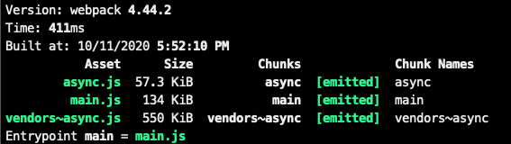

How the javascript module bundler splits your code is one of the most important concepts to know when optimizing your website's performance. Understanding how chunking/splitting works makes the developer not see the bundler as a black box. 


In this post, I will cover how __SplitChunksPlugin__ splits the javascript code into multiple chunks and how some of the customization options of __SplitChunksPlugin__ affect the formation of chunks.

Before we go over the main content, let's understand some basic terminologies that will help us understand the content better.

### What's a chunk?

In layman terms, you can think of a chunk as a piece of javascript code that can execute independently. Chunks might have a dependency on other chunks, and in that case, other chunks have to be executed before the final chunk is executed.

<br />

__From webpack docs:__

This webpack-specific term is used internally to manage the bundling process. Bundles are composed out of chunks, of which there are several types (e.g., entry and child)

### Types of chunks

In the webpack world, we have two types of chunks:

__1 => Entry chunk -__ These are defined in the webpack config file as an entry point, and _webpack_ generates them after the build. 

__2 => Child chunk -__  These chunks are made from the modules imported inside the files defined in the entry point and are made when they are imported dynamically or made by __SplitChunksPlugin__ webpack plugin.

### Types of chunks based on execution behavior

__1 => Sync chunk -__ The chunks which have to run on the initial page load for the app to run. These chunks are defined in the script tag of HTML and are downloaded as soon as the user visits the application.

__2 => Async chunk -__ The chunks which are fetched from the server on demand i.e downloaded/executed only when requested from the client after initial page load.

### SplitchunksPlugin in action

__Default__

By default, if we don't provide any __SplitChunksPlugins__ option in the webpack config file, it chunks/splits every dynamically loaded module(async/on-demand module), and it also splits any modules imported from _node_modules_. __SplitChunksPlugin__ tries to optimize the async chunks by default i.e., splits up any module imported from _node_modules_ in the async chunk.

<br />

Consider we have the following webpack file -

```js
const path = require('path');
const BundleAnalyzerPlugin = require('webpack-bundle-analyzer').BundleAnalyzerPlugin;

module.exports = {
  mode: 'development',
  entry: './hello.js',
  output: {
    path: path.resolve(__dirname, 'dist'),
    filename: '[name].js',
    chunkFilename: '[name].js',
  },
  plugins: [new BundleAnalyzerPlugin()],
};
```

And we have the following application code -

<br />

_hello.js_

```js
import React from 'react';

import(/* webpackChunkName: "async" */ './async');

console.log('hello, people!');
```

_async.js_

```js
import React from 'react';
import 'lodash';

console.log('I am async chunk');
```

Webpack bundle analyzer screenshot -




If you look at the above screenshot carefully, webpack has created three separate chunks.

<br />

__Why ?__

- _async.js_ chunked because it's dynamically loaded.

- _vendors~lodash.js_ chunked because it's imported from _node_modules_ and is imported in _async_ chunk.

- _main.js_ chunked because it's defined as an entry point in the webpack config file.

<br />

__Q.__ Now you might think of a question why wasn't the _react_ module chunked in a different file as it's also imported from _node_modules_?

Here's how to think about it, _react_ is imported in the entry chunk file, which is _hello.js_, and it's also being used in the async chunk, which is _async.js_, the entry chunk will be loaded whenever the webpage is rendered, and entry chunk already contains _react_ so there is no reason for webpack to create a new chunk.

Consider when the lazy-loaded chunk (_async.js_) is requested after the page loads, you will not want that it downloads the _react_ again over the network, right?

#### Configuration

__SplitChunksPlugin__ provides set of properties to customise chunking according to the use case. The property which we are going to discuss below is __optimization.splitChunks.chunks__ and is used in webpack config like:

```js
const path = require('path');
const BundleAnalyzerPlugin = require('webpack-bundle-analyzer').BundleAnalyzerPlugin;

module.exports = {
  ....
  optimization: {
    splitChunks: {
      chunks: 'all', // can be 'initial' and 'async' too
    },
  },
  ....
};
```

__Note__: _optimization.splitChunks_ property in the webpack  is used to customse the behaviour of __SplitChunksPlugin__

__chunks__ property accepts values of three types

<br />

__1 => all__

If we provide _all_ as _chunks_ option, we tell __SplitChunksPlugin__ to chunk the dynamically imported modules as well as chunk the modules which are shared between the module defined as an entry and the dynamically imported modules. __SplitChunksPlugin__ tries to optimize both the sync and async chunk. Let's see an example to get a better sense of this option.

<br />

Consider we have the following webpack file -

```js
const path = require('path');
const BundleAnalyzerPlugin = require('webpack-bundle-analyzer').BundleAnalyzerPlugin;

module.exports = {
  mode: 'development',
  entry: './hello.js',
  output: {
    path: path.resolve(__dirname, 'dist'),
    filename: '[name].js',
    chunkFilename: '[name].js',
  },
  optimization: {
    splitChunks: {
      chunks: 'all',
    },
  },
  plugins: [new BundleAnalyzerPlugin()],
};
```

And consider we have the same application code as used in the default section.

<br />

Webpack bundle analyzer screenshot - 


If you look at the above screenshot carefully, webpack has built four chunks

<br />

__Why ?__

- _main.js_ chunked because it's defined as an entry point in the webpack config file.

- _vendors~async.js_ chunked because the _lodash_ module is imported from _node_modules_ and is imported in _async_ chunk. 

- _async.js_ chunked because it's dynamically loaded.

- _vendors~main.js_ this is an extra chunk if we compare it with the default option. If you look carefully in the chunk contents, it contains the _react_ module, and why is that? Let's check the definition for this option again i.e., it will create a chunk with the modules shared between the entry modules and async modules.

<br />

__2 => initial__

If we provide _initial_ as _chunks_ option, we tell __SplitChunksPlugin__ to chunk dynamically imported modules and the modules that are shared between the files defined in the entry config. __SplitChunksPlugin__ tries to optimize only the sync chunks, i.e., the files specified in the entry option of the webpack config.

<br />

Consider we have the following webpack file -

```js
const path = require('path');
const BundleAnalyzerPlugin = require('webpack-bundle-analyzer').BundleAnalyzerPlugin;

module.exports = {
  mode: 'development',
  entry: './hello.js',
  output: {
    path: path.resolve(__dirname, 'dist'),
    filename: '[name].js',
    chunkFilename: '[name].js',
  },
  optimization: {
    splitChunks: {
      chunks: 'initial',
    },
  },
  plugins: [new BundleAnalyzerPlugin()],
};
```

And we have the following application code -

<br />

_hello.js_

```js
import React from 'react';

import(/* webpackChunkName: "async" */ './async');

console.log('hello, people!');
```

_bello.js_

```js
import 'graphql';

console.log('bello!, people');
```

_async.js_

```js
import React from 'react';
import 'lodash';

console.log('I am async chunk');
```

<br />

Webpack bundle analyzer screenshot - 


If you look at the above screenshot carefully, webpack has created five separate chunks

<br />

__Why ?__

- _hello.js_ chunked because it's defined in the entry option of webpack config.
- _bello.js_ chunked because it's defined in the entry option of webpack config.
- _async.js_ chunked because it's async/on-demand chunk. Note that _lodash_ is not chunked as a sperate chunk like the last option because this option does not make optimization over async chunks, and _lodash_ is being used in the async chunk.
- _vendors~hello.js_  chunked because _react_ is imported from _node_modules_ and is used in the sync module. Remember that this option makes optimization over sync chunks.
- _vendors~bello~hello.js_ - As we already learned in the definition that this option tries to chunk the modules shared between the entry options defined in the webpack config. _graphql_ module is imported in both _hello.js_ and _bello.js_

__3 => async__

This option is same as the default section i.e __SplitChunksPlugin__ uses _async_ option if we don't provide any option in _optimization.splitChunks.chunks_.

<br /><br /><br /><br />

That's it for this blog; I have tried to explain the option which I felt the most misunderstood option while customizing __SplitChunksPlugin__. It might feel like a lot of content in the first go but try to play with the code a little, and it will make sense in the end.

<br />

Let me know if you liked the post or have any suggestions around it by twittering out to me. Thank you for the time that you invested in reading this post :).
