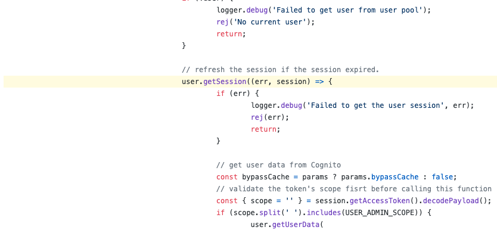

Aws amplify is a framework that allows developers to integrate user authentication in their applications quickly, along with some other useful services to create full-stack applications. Amplify uses AWS Cognito service under the hood to achieve user authentication.

Let us see how we can link our custom login/signup component with AWS Amplify to authenticate our users and persist the user session across different web pages.

__Note:__ I will be using the starter react app created by `create react app` as the base project and do all of the below steps.

### Prerequisites

Let's start by setting up the prerequisites required to set up `aws-amplify` in our project.

1. Install `aws-amplify` CLI.

```bash
npm install -g @aws-amplify/cli
```

2. Configure amplify for your project.

```bash
amplify configure
```

3. As soon as you write this command and press enter, it will ask you to log in to the AWS console in your browser. Login to your AWS account, or if you don't have an account, then create one.

4. Then come back to your terminal; it will be waiting for an enter keystroke.

5. It will ask for a region, select the appropriate option, and press enter.

6. It will ask for a user name now. Go to your AWS console, select IAM (identity access management), click on `users` options, and then select `Add user` option.

7. Create a new user with an administrative role so the `amplify-cli` can use this user to manage resources on AWS.

import Video from "../../src/components/Video";

<Video videoSrcURL={'https://player.vimeo.com/video/479817610'} videoTitle="Step 7" />

8. Go back to the terminal, add the user, key, secret, and then select the default profile.

### Amplify Auth setup

1. Initialize new amplify project.

```bash
amplify init
```

<Video videoSrcURL={'https://player.vimeo.com/video/479846494'} videoTitle="amplify init clip" />

2. Add the authentication service via _amplify_ cli.

```bash
amplify add auth
```

<Video videoSrcURL={'https://player.vimeo.com/video/482259303'} videoTitle="amplify add auth service" />

3. To create the resources required to do authentication via `amplify`, push the configuration using the following command.

```javascript
amplify push
```

<Video videoSrcURL={'https://player.vimeo.com/video/482259485'} videoTitle="amplify add auth service" />

__Note__: The above command will take a few minutes, wait till your resources are created.

4. Install amplify js SDK

```bash
npm install aws-amplify
```

5. Once the installation is done, open `src/index.js` and add the below lines to it at the top.

```javascript
import Amplify from "aws-amplify"; 
import awsExports from "./aws-exports"; 
Amplify.configure(awsExports);
```

### Connect UI to Amplify Auth Service

1. Add the below folders from codesandbox to set up a basic UI for sign up and log in.

```bash
src/Join
src/Login
src/common
src/App.js
```

<br />

import Codesandbox from "../../src/components/Codesandbox";

<Codesandbox sandboxurl={src="https://codesandbox.io/embed/signup-login-y0eey?autoresize=1&fontsize=14&hidenavigation=1&theme=dark"} title="signup-login" />

<br />

__Note:__ Make sure to install the following packages before running your project with the above components.

```bash
@react/router
styled-components
```

Now we have a basic auth component setup, let's see how we can use `amplify` to login and signup users.

2. Go into `join.js`, you will see one `join` function, and it will be called when we click on the _Get started now_ button. Just have a look at the component; you will get an idea of how this component works.

3. Now import _Auth_ from _@aws-amplify/auth_

```js
import { Auth } from "@aws-amplify/auth";
```

4. In the _join_ function, add the following code.

```bash
Auth.signUp({ username: email, password: pass }).then((res) => {
  console.log(res);
});
```

5. Now, after all these steps, we should be able to signup users. Just enter your email and pass and keep your console open; you will see a successful response from aws.

<Video videoSrcURL={'https://player.vimeo.com/video/482268698'} videoTitle="sign up user" />

If it was your valid email, you must have got some verification code. Ideally, another screen should be there after the signup screen to verify the user. I have not included that screen in the components; you can go ahead and create. Before trying to log in, let's make sure to verify the user which you have signed up above from the cognito console. You may use the following command to open the console.

_Note_: The default requirement from aws cognito is that the password should be of a minimum 8 characters in length.

```bash
amplify console
```

<Video videoSrcURL={'https://player.vimeo.com/video/482271840'} videoTitle="confirm user" />

6. Let move to sign in now, import _Auth_ in _login.js_.

```javascript
import { Auth } from "@aws-amplify/auth"; // import
```

7. Add the following code to _login_ function. It gets called when _Sign In_ button is clicked.

```javascript
Auth.signIn(email, pass).then((res) => {
  console.log(res)
});
```

8. Let's try to log in to the user we created above; keep your console open. If you followed everything till here, you should see a successful response from aws.

<Video videoSrcURL={'https://player.vimeo.com/video/482274587'} videoTitle="sign in user" />

Nice, you have a fully working login/signup component to integrate in your project.

### User session persistence

You don't want your user to log in again when they refresh the page, or the user navigates between the page. One of the function being _currentAuthenticatedUser_

```bash
Auth.currentAuthenticatedUser().then(({ username, attributes }) => {
  console.log({username, attributes})
});
```

You can use the above code to set the current authenticated user in the state and use that value in your component to check whether the user is logged in or not based on its value.

Now, here is a question to think over.

#### Q. How are we getting the current authenticated user?

Whenever a user successfully logs in, the `amplify` SDK stores a bunch of data in the browser's local storage and uses that data to figure out whether the user is logged in or not. Long story short, amplify SDK stores an authenticated token in the local storage with a validity of 1hr. If the user comes back to the app without doing anything on the app for an hour, the amplify SDK itself refreshes the token and reauthenticates it.

<Video videoSrcURL={'https://player.vimeo.com/video/482279275'} videoTitle="session persistence" />

Here's a snapshot from amplify SDK for reauthentication code. 



Here's the [link](https://github.com/aws-amplify/amplify-js/blob/a047ce73/packages/auth/src/Auth.ts) to the file, if you want to peek more into the code.


<br /><br /><br />


That's it from this post; please share it if you find it useful or [reach out](https://twitter.com/tech_adhyan) to me if you think anything is off.