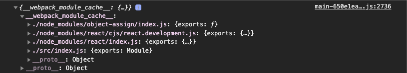

Webpack, for most people, has been and still is like some magic box that takes some JS files and spits out several files to use in our application. This post will not talk about how it does that but will try to explain the final file's output after passing it via webpack.

I will take [this](https://github.com/adhyans/webpack-starter) webpack starter project as a base to explain  webpack's build output. Take the clone of the project to follow play with the code used in the code or just read along.

Run `npm run build` in the project's root directory. A build directory will be generated if not already there and it will contain `main-{somehash}.js`. The build file should look like the following -

```js
(()=>{"use strict";console.log("I am the entry component")})();
```

The above code is a [IIFE](https://developer.mozilla.org/en-US/docs/Glossary/IIFE) and the body of the [IIFE](https://developer.mozilla.org/en-US/docs/Glossary/IIFE) contains the contents of our entry file. Our entry file is [src/index.js](https://github.com/adhyans/webpack-starter/blob/main/src/index.js).

<Info>Wrapping the code in IIFE makes it safe from polluting the global namespace i.e any function, var defined in the file won't clash with the names already defined in the global namespace.</Info>

Let's add one `import` to `src/index.js` and see how the output changes. Create a file `src/test.js` in parallel to `src/index.js`.

```js
// test.js

export default function test() {
  console.log('I am a test function');
}
```

```js
// index.js

import test from './test.js';

const app = () => {
  console.log('I am the entry component');
};

test();
app();
```

Run `npm run build` and check the build file, it should look like the following -

```js
(()=>{"use strict";console.log("I am a test function"),console.log("I am the entry component")})();
```

The one thing we are sure of now is that webpack wraps the entry file in the IIFE due to the reason stated above. If you play with the calling of the test function a little i.e changing the position of where it's being called the console log from the test function changes accordingly.

The above output is pretty straight forward and understandable. Let's `import` a function in `src/index.js` and `src/test.js` and see how the output build changes. Note that we are importing the same function in both the files.

```js
// new file: common.js

export default function common() {
  console.log('I am a common function');
}
```

```js
// index.js

import test from './test.js';
import common from './common.js';

const app = () => {
  console.log('I am the entry component');
};

test();
app();
common();
```

```js
// test.js

import common from './common';

export default function test() {
  console.log('I am a test function');
}

common();
```

Run `npm run build` and check the build file, it should look like the following -

```js
(()=>{"use strict";function o(){console.log("I am a common function")}o(),console.log("I am a test function"),console.log("I am the entry component"),o()})();
```

The import which is same in both of the files is extracted into a function and is referenced with the same name wherever it's being used. Webpack makes sure that the import which is being used at multiple places is not replaced by multiple function declaration of the same function thus keeping the final bundle size small.

Let's change the `src/index.js` file and import `React` to see how the build output changes.

```js
// app.js

import React from 'react';

const app = () => {
  console.log('I am the entry component');
  console.log(React);
};

app();
```

Run `npm run build` and check the build file. The build file is too big to include here. I will just go over the important pieces of the code to make you understand how it's working. Search for the piece of code when in discussion in the below to relate more.

<br />

__1__. The ____webpack_module_cache____ object

This object contains all the loaded/executed modules for the current chunk. Once the current build file is executed the cache pbject looks like the following



For now just consider the cache object contains all the modules executed during the chunk load.

<br />

__2.__ The ____webpack_require____ function. This is function is at the very end of every chunk created by webpack. This function takes some _moduleId_ and returns the value if mapping of the _moduleId_ is present in the ____webpack_module_cache____ object. This function is responsible for populating the cache object.

```js
  // The module cache
  var __webpack_module_cache__ = {};

  // The require function
  function __webpack_require__(moduleId) {
    // Check if module is in cache
    if (__webpack_module_cache__[moduleId]) {
      return __webpack_module_cache__[moduleId].exports;
    }
    // Create a new module (and put it into the cache)
    var module = (__webpack_module_cache__[moduleId] = {
      // no module.id needed
      // no module.loaded needed
      exports: {},
    });

    // Execute the module function
    __webpack_modules__[moduleId](module, module.exports, __webpack_require__);

    // Return the exports of the module
    return module.exports;
  }
```
<br />

__3.__ Load entry module for the chunk. The entry module for the current project is `src/index.js` as defined in the webpack config file. If you look at the end of the build file there is a function call to load the entry module.

```js
// startup
// Load entry module
__webpack_require__('./src/index.js');
```

<br />

__4.__ Webpack modules object. The modules object contains code of all the modules used inside the project. The key is the name of the file and the value contains a function with the body of our code. This object is generallt present at the top of the build file.

```js
var __webpack_modules__ = {
  './src/index.js': () => {
    // code
  },
  './node_modules/object-assign/index.js': () => {
    // code
  },
  './node_modules/react/cjs/react.development.js': () => {

  },
  // ... all the remaining modules.
};
```

<Info>The thing to note here is that the code from each and every file which we write and use is now scoped in a function by webpack. So there is no chance of variable name, function name collisions.</Info>

Let's explore the code in `__webpack_modules__['./src/index.js']` as this is the function which starts the execution of the chunk. Here's the code:

```js
__webpack_require__.r(__webpack_exports__);
var react__WEBPACK_IMPORTED_MODULE_0__ = __webpack_require__('./node_modules/react/index.js');

var app = function app() {
  console.log('I am the entry component');
  console.log(react__WEBPACK_IMPORTED_MODULE_0__);
};

app();
```

__When does the above code is executed?__

Remember the load module call in the last step using ____webpack_require____ function, if you look at the function body of the require function you will observe when the code corresponding to the _moduleId(i.e filename)_ is not found in the cache object then the code corresponding to that _moduleId_ is called using the ____webpack_modules____ object. The value of properties in the modules object is always a function.


The `src/index.js` file has a dependecy on the react module and you can see in the above code that webpack resolves the dependecy using the ____webpack_require____ function and the same process happens for the react module like we discussed for the loading of `src/index.js` in the last section.

<Info>The thing to note here is that code from each of the imported module is executed only once and the export values/functions from that file are cached. So, when the same import is used in another file the exported modules can be used directly rather than running the file again.</Info>

If you do any intensive operation in file and export the resultant value for other functions to use, the operation is done only when the chunk is loaded/executed not for the number of imports of that file.

### Observations

__1.__ Each module is loaded/executed using ____webpack_require____ function.

__2.__ The ____webpack_require____ function populates the ____webpack_module_cache____ object.

__3.__ The ____webpack_modules____ object contains the code for each and every modules used inside the chunk and is wrapped in a function by webpack.

__4.__ The modules are executed only once not for the number of times they are imported.

__5.__ The exported functions from the any module/file when used in other module/file have access to variable and functions of the file in which they were defined due to __Closure__.

<br />

Webpack tries to output the most optimized build file based on the code you have writtern and the webpack config file. In one of the future posts, I will try to explore how the build file is changed when we use dynamic import in our code or may be how tree shaking works based on how we write our code.

<br />

That's it from this blog. Let me know if you liked this blog or hoped to get something more out of this. Thank you very much for your time ⏲🙏.
