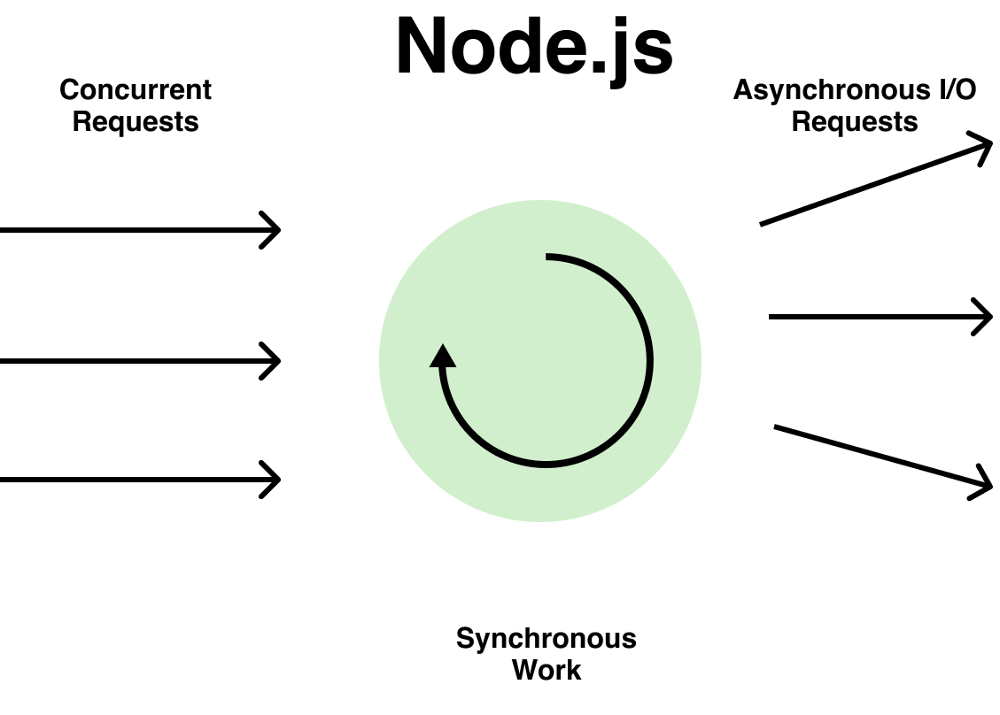
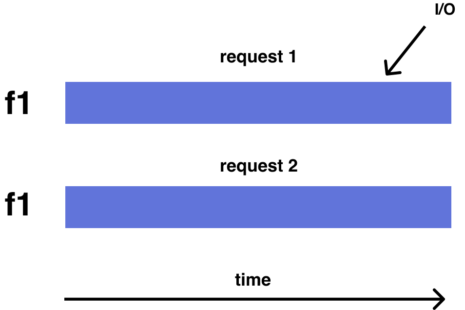
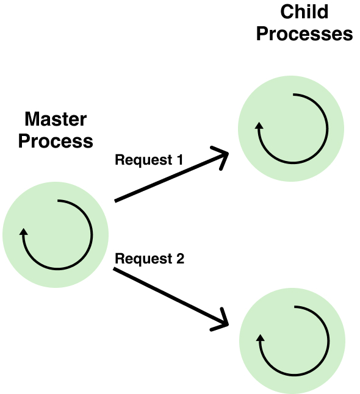
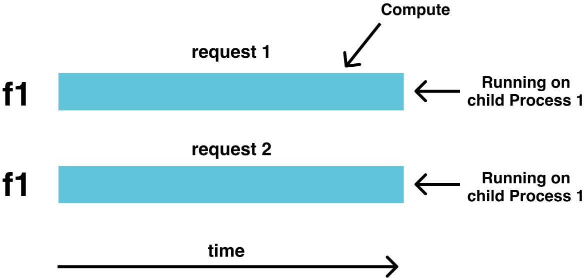

___Note___: Understanding of how node.js works is required to completely understand this post. 

This post will discuss one of the problems while using SSR with node.js on scale. By scale means the SSR application is catering to a large number of users simultaneously.

Node.js can serve many concurrent requests if the work done by node.js for each request is highly asynchronous. E.g., for each request from the client, node.js collects data from a lot of other services and does minimal work on the main thread before returning the response to the user. E.g., a node.js application that maintains web socket connections of many clients and delivers data to the client when required.

SSR workflow is a bit different from how an ideal node.js application should work i.e minimum work on the main thread. Rendering a react applicaton on node.js is a compute intensive process i.e it happens on the main thread and takes a significant amount of time.

Consider f1 to be an I/O type functon and executed on different concurrent requests

The above diagram shows that I/O functions can be resolved parallely but that's not the case if the function is of type compute which is in case of SSR with react application.

Consider f1 to be an compute type functon and executed on different concurrent requests

The process of getting HTML from a react component is a compute intensive process and can lead to slowing down of the requests if not handled carefully. Few requests can clog other requests and make the end use experience bad.

### How to make sure that request clogging does not happen 🤔 ?

Using node.js [cluster](https://nodejs.org/api/cluster.html#cluster_cluster) module helps to minimize this affect. By default a single instance of node.js runs in a single thread. Cluster module helps to spawn multiple node.js processes. The cluster module enables one master node.js process and it assigns requests to child node.js processes in round robiin fashion.

Here's how compute intensive function f1 will execute in cluster module setup

Using cluster module is not a full proof solution because the following state can happen where one of the child process is still processing the request and the master process assigns the incoming request to it because it was the turn of the chlid process to process the request.

<!-- add the diagram of the state that can happen due to round robin processing -->

<!-- add the diagram of the state that ideally should happen -->

<!-- how to achieve the ideal state -->
